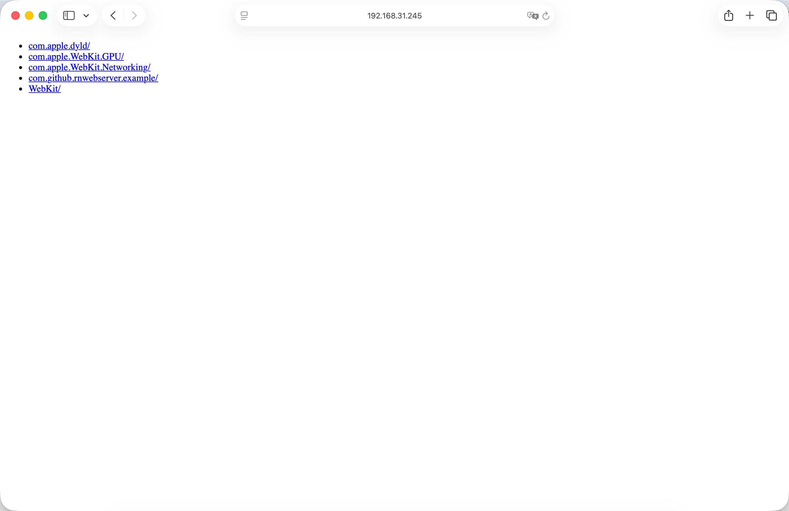

# @activatortube/react-native-web-server

一个轻量级的 React Native Web 服务器，用于将应用沙盒目录作为静态文件提供服务。

[English](./README.md) | [中文文档](./README.zh.md)

## 功能特性

- 🚀 轻量级、高性能的本地 Web 服务器
- 📁 支持多个路径前缀映射
- 🔄 可以动态启动和停止服务器
- 📱 支持 iOS 和 Android 平台
- 🎯 完美配合 WebView 使用

> **⚠️ 注意：** 本库目前仅支持 React Native 的新架构（New Architecture），暂不支持旧架构（Old Architecture）。欢迎通过 Pull Request 贡献代码以支持旧架构！

## 使用场景

这个库非常适合需要通过 Web 服务器提供本地文件，而不是直接通过 WebView 的 `file://` 协议加载文件的场景。以下是相比直接加载本地文件的主要优势：

### 相比直接使用 WebView 加载本地文件的优势

1. **跨域资源共享 (CORS) 支持**
   - 通过 HTTP 提供的 Web 内容可以正确处理 CORS 策略
   - 允许加载外部资源和 API，不受 CORS 限制
   - 直接的 `file://` 协议通常会阻止跨域请求

2. **网络可访问性**
   - 支持同一局域网内其他设备的访问
   - 非常适合在多个设备上同时进行测试和调试
   - 允许与网络上的其他应用或服务共享内容

3. **标准 HTTP 协议**
   - 使用标准 HTTP/HTTPS 协议，确保与 Web 库更好的兼容性
   - 许多 Web 框架和库期望使用 HTTP URL
   - 更好地支持 Service Workers、WebSockets 等功能

4. **动态内容服务**
   - 可以提供动态生成或修改的内容
   - 更容易实现路由和路径映射
   - 更灵活的文件服务策略

5. **更好的安全模型**
   - HTTP 服务器可以实现适当的安全头
   - 对内容交付和访问策略有更多控制

### 使用场景

- 提供需要 HTTP 协议的 HTML5 游戏或交互式 Web 内容
- 在多个设备上同时测试 Web 内容
- 与其他应用或服务共享本地内容
- 提供需要与需要 HTTP 上下文的 Web API 配合使用的内容
- 需要网络访问的调试和开发场景

## 安装

使用 npm 或 yarn 安装：

```bash
npm install @activatortube/react-native-web-server
# 或
yarn add @activatortube/react-native-web-server
```

### iOS 安装

对于 iOS，需要安装 CocoaPods 依赖：

```bash
cd ios && pod install
```

## 使用方法

### 基本示例

以下示例展示了如何在 React Native 应用中使用 `@activatortube/react-native-web-server` 来启动一个本地 Web 服务器，并在 WebView 中显示内容：

```tsx
import { useEffect, useState } from 'react';
import { View, StyleSheet } from 'react-native';
import WebServer from '@activatortube/react-native-web-server';
import WebView from 'react-native-webview';
import RNFS from 'react-native-fs';

function AppContent() {
  const [port, setPort] = useState(0);

  useEffect(() => {
    WebServer.start([{
      prefix: '/',
      path: Platform.OS === 'android' ? RNFS.CachesDirectoryPath : RNFS.DocumentDirectoryPath,
    }]).then((result) => {
      console.log('WebServer started at port', result);
      setPort(result);
    }).catch((error) => {
      console.error('WebServer start failed', error);
    });

    return () => {
      WebServer.stop();
    }
  }, []);

  return (
    <View style={styles.container}>
      <WebView
        source={{ uri: `http://localhost:${port}/` }}
      />
    </View>
  );
}

const styles = StyleSheet.create({
  container: {
    flex: 1,
  },
});
```

### 多路径映射

你也可以配置多个路径前缀映射：

```tsx
WebServer.start([
  {
    prefix: '/',
    path: RNFS.CachesDirectoryPath,
  },
  {
    prefix: '/game',
    path: RNFS.DocumentDirectoryPath + '/game',
  },
]);
```

## API 文档

### `WebServer.start(handlers: HandlerOptions[]): Promise<number>`

启动 Web 服务器。

**参数：**
- `handlers`: 路径处理器配置数组
  - `prefix`: 请求的路径前缀，根目录为 `/`
  - `path`: 需要被访问的文件夹路径。例如：如果 `prefix` 使用 `/game`，那么访问 `/game/index.html` 会访问到 `path/index.html`

**返回值：**
- `Promise<number>`: 返回服务器启动的端口号

**注意：** 可以重复调用，如果已经启动了，那么将停止上次启动的服务，并启动新的服务。

### `WebServer.stop(): void`

停止 Web 服务器。

## 截图


*在同一个 app 内通过 WebView 直接访问 web 服务器*



*在局域网中使用 IP 地址和端口从其他设备访问 web 服务器*

## 依赖要求

- React >= 18.0.0
- React Native >= 0.72.0

## 许可证

Apache-2.0

## 相关链接

- [GitHub 仓库](https://github.com/WheelerLee/react-native-web-server)

